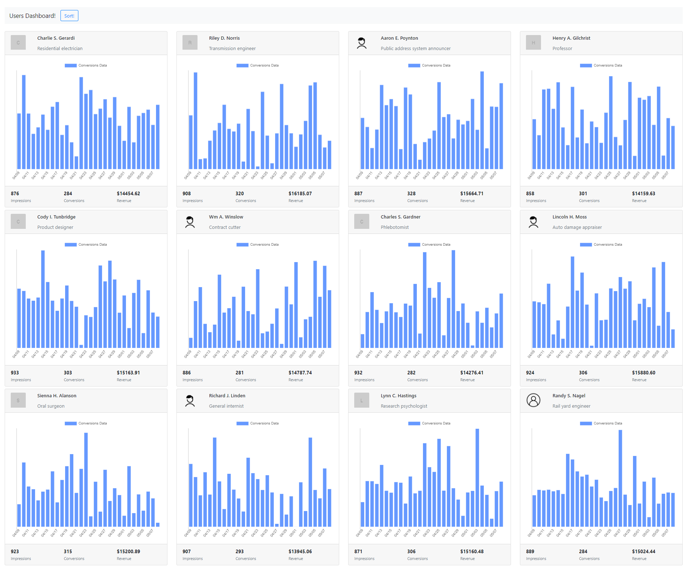

## Tune Challenge



# Framework / Library
This project is created using Laravel + Vuejs

#How to run/install
## After Cloning this repository. Follow below given steps!

1 - Install required packages/dependecies for laravel

```
composer install
```
2 - Install required packages/dependecies for Vuejs

```
npm install 
```

3 - Set path of your application in MIX_BASE_URL in .env file. By default its http://127.0.0.1:8000/api

4 - Clear config and cache of application

```
php artisan config:cache 
```
5 - compile js files/components for serving
```
npm run dev
```
6 - serve your project
```
php artisan serve
```

- Open the url where application is served. 
- Users dashboard will be render with cards containing users with their stats.
- Sorting can be performed by clicking the button on top navbar.

- Unit testing can be test by running below given commands in root directory

```
php artisan test
```

#### Extra Information/Instructions

- Currently using json file for data model. Also created models for future use if we need to make database level data manipulation. Only need a database connection and migrations to be executed.
